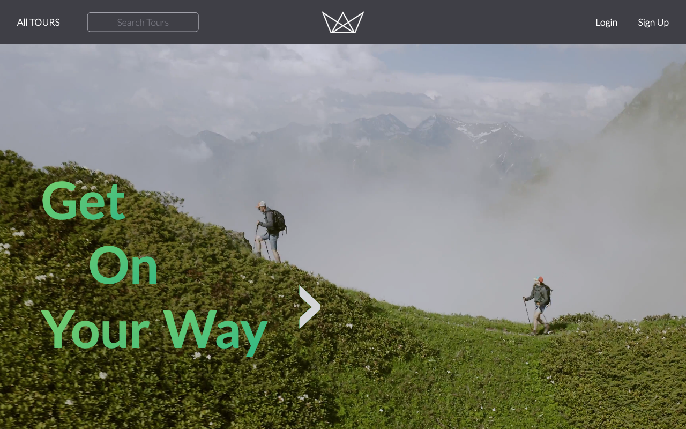
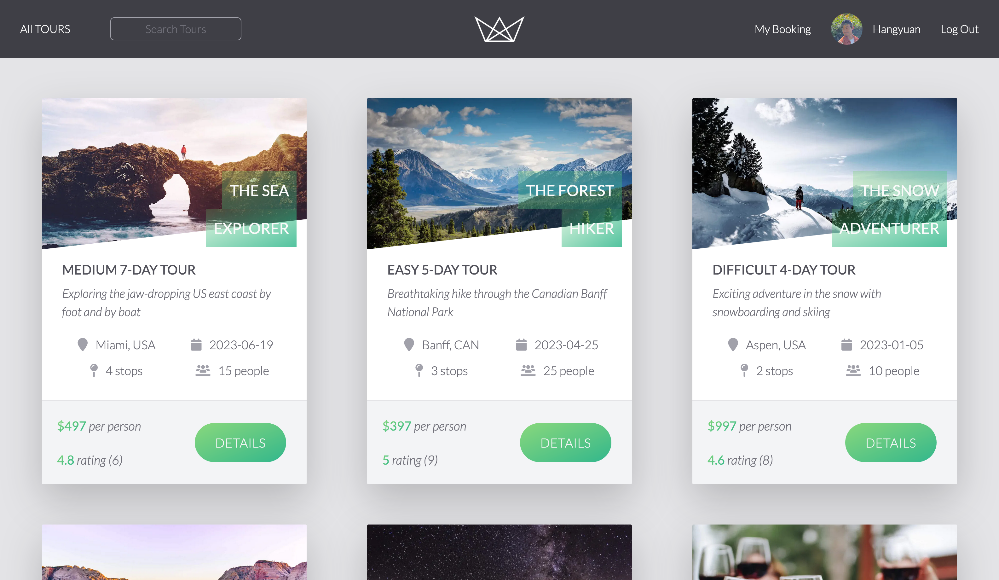
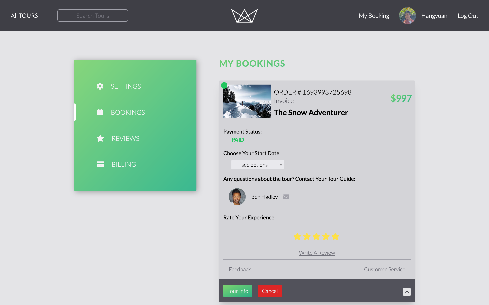
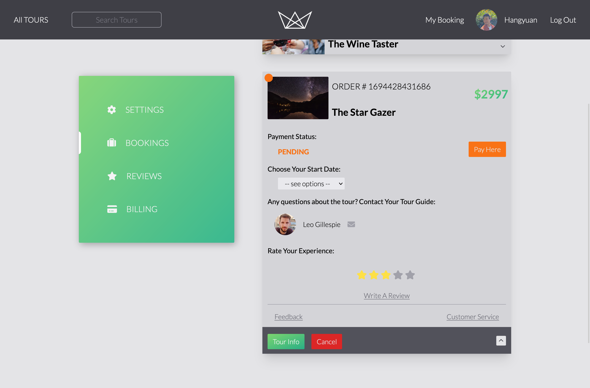
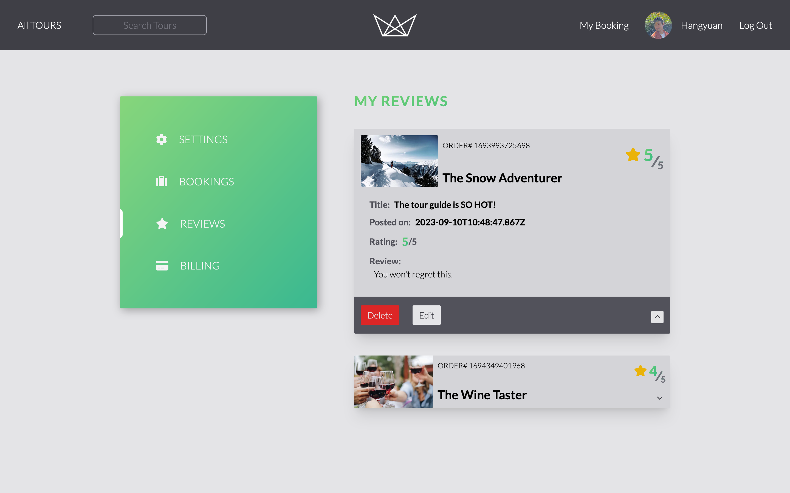
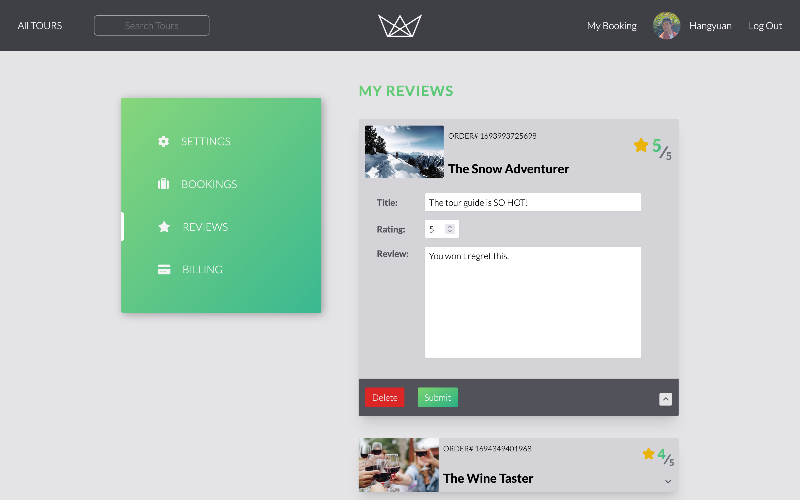
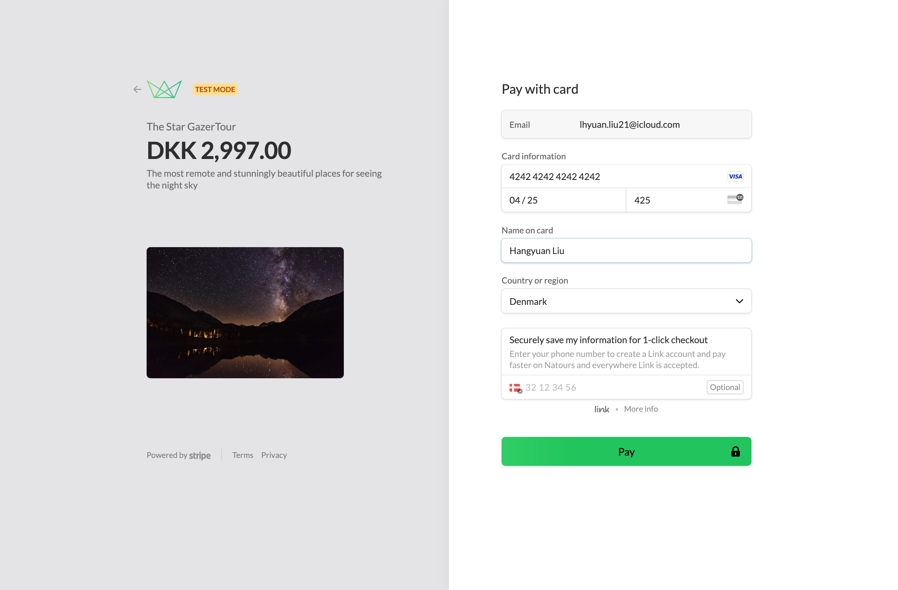
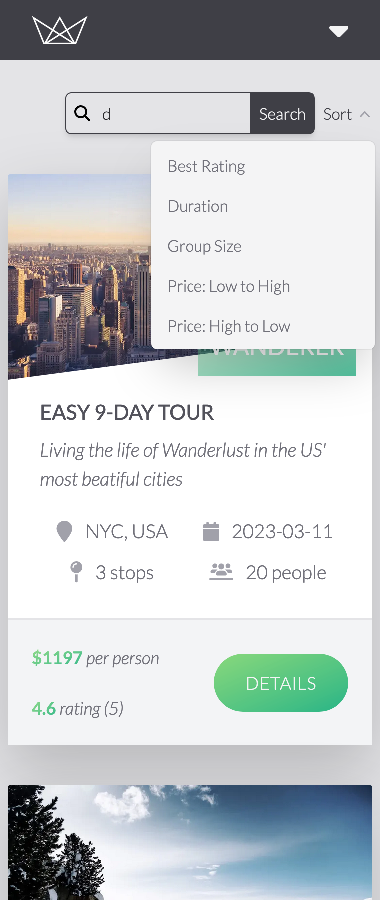
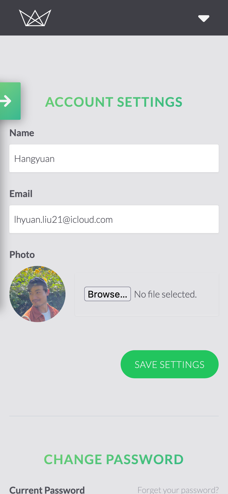

# Natours - a touring website

This is a full-stack website from an Udemy course.

The original project is built with JavaScript, Express, MongoDB, and Pug templates.

I followed the course, but took the liberty to rebuild the website using the tools of my own choice - `TypeScript` and `Next.js`.

1. The entire frontend is rebuilt using Next.js, leveraging React server/client component and TypeScript.
1. The backend is rewritten with TypeScript, which is hosted in another [repository](https://github.com/llhyuan/natour-backend).
1. The database used is MongoDB, paired with Mongoose and TypeScript for better data modeling.  

## Why TypeScript?

I learned Rust a few months ago out of the hype around it, and fell in love with its type system and compiler driven development approach.

It was hard work navigating all the compiler warnings and errors. However, it paid off in the long run. Every step of the way, the flow of data was much more clear and variables were used with an understanding of what they can or cannot be. This had an immediate impact, significantly reducing the amount of time spent tracing back error stacks.

## Table of Content

- [About](#about)
  - [Features](#features)
  - [Links](#links)
  - [Screenshots](#screenshots)
  - [Built With](#built-with)
- [Author](#author)

## About

### Features

- Compiler-driven development with TypeScript
- Server side rendering, leveraging Next.js and React Server Component
- Better data modeling and validation with mongoose and TypeScript, on top of MongoDB
- Httponly cookie and JSON Web Token are combined to delivery safer user validation.
- Seamless payment processing with Stripe and webhooks.
 - Use the following card detail to place an order live:
  - Card number: 4242 4242 4242 4242
  - Exp: any data that later than the day you place the order 
  - Name: any name
  

### Links

- Live Site URL: [Vercel](https://natours-llhyuan.vercel.app)

### Screenshots

- Home Screen\
  

- Login\
  

- Tours page\
  

- Tour\
  

- Booking & Review\
  
  
  
  

- Checkout\
  

- Search\
  

- Setting\
  

### Built with

- TypeScript
- React server component
- Next
- Tailwind css
- Node
- Express
- MongoDB & Mongoose

## Author

- LinkedIn - [Hangyuan Liu](www.linkedin.com/in/hangyuan-liu-a9282718b)
- Frontend Mentor - [@llhyuan](https://www.frontendmentor.io/profile/llhyuan)
